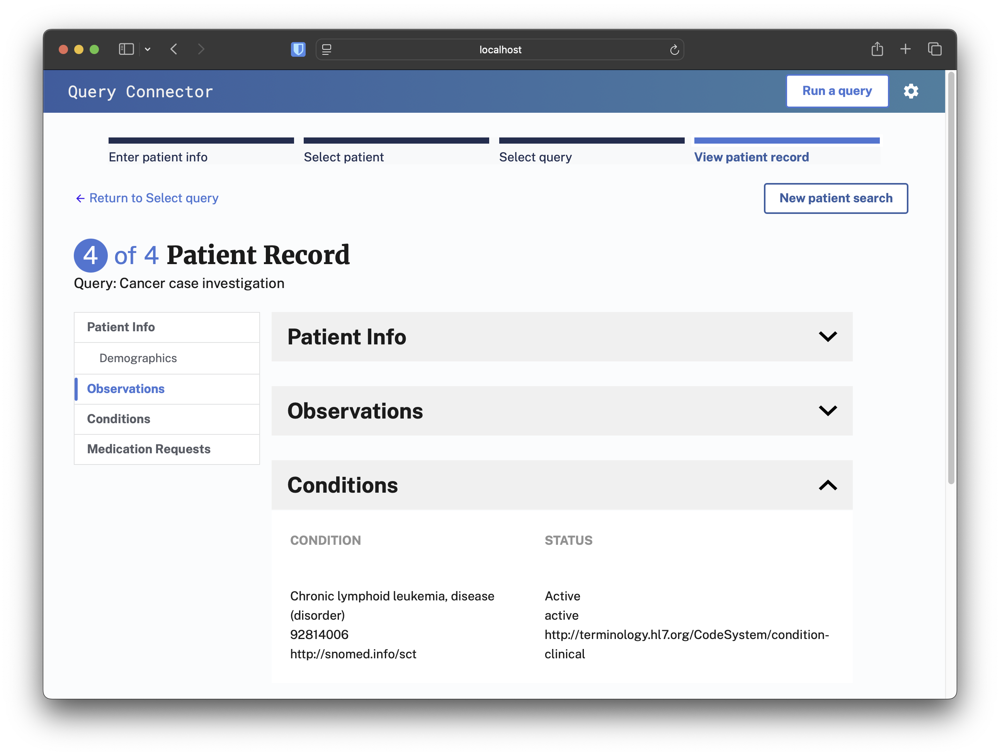

# DIBBs Query Connector

## Overview

This repository is a part of the CDC [DIBBs project](https://cdcgov.github.io/dibbs-site/) and seeks to build the DIBBs Query Connector.

The DIBBs Query Connector app offers a REST API and comprehensive UI for public health staff to query a wide network of healthcare organizations (HCOs), providing access to more complete and timely data.

The Query Connector is a tool for public health practitioners to quickly retrieve patient records and relevant case information from HCOs. The tool works either by making direct FHIR queries or by connecting to Qualified Health Information Networks (QHINs) within the Trusted Exchange Framework and Common Agreement (TEFCA), ensuring immediate access to essential health data and facilitating timely public health decisions and interventions. Public health staff can interact with the Query Connector manually by entering simple patient details — such as name, date of birth, or medical identifiers — into a web-based search form. The tool also allows for automated queries via integration engines like Rhapsody and Mirth.

### Problem Scope

Current public health systems that digest, analyze, and respond to data are siloed. Lacking access to actionable data, our national, as well as state, local, and territorial infrastructure, isn’t pandemic-ready. Our objective is to help the CDC best support PHAs in moving towards a modern public health data infrastructure. See our [public website](https://cdcgov.github.io/dibbs-site/) for more details.

The current methods that public health jurisdictions use to collect data from HCOs can be time-consuming and cumbersome, often involving manual interventions like phone calls and faxes. The Query Connector aims to streamline the collection of health data using an intuitive querying process that can leverage QHINs within TEFCA or direct connections, thereby enabling data exchange from multiple HCOs for a variety of public health use cases such as newborn screening or STI case investigation.

DIBBs Query Connector is a sibling project to

- [DIBBs ECR Viewer](https://github.com/CDCgov/dibbs-ecr-viewer/) to further help display, access, and interpret public health data;
- [PRIME ReportStream](https://reportstream.cdc.gov), which focuses on improving the delivery of COVID-19 test data to public health departments; and
- [PRIME SimpleReport](https://simplereport.gov), which provides a better way for organizations and testing facilities to report COVID-19 rapid tests to public health departments.

## Documentation

You can find more detailed documentation, guides, and tutorials here:

- For developers:
    - [Local development](docs/development.md)
    - [Contributing changes](docs/contributing.md)
    - [Release process](docs/release.md)
- For public health IT staff:
    - [Architecture](docs/architecture.md)
    - [Deploying Query Connector](docs/deployment.md)
    - [API Docs](docs/api.md)
- For public health case investigators: 
    - [Query Connector User Guide](docs/user_guide.md)

## Try it out!

Access to the demo instance of the latest official release DIBBs Query Connector is available at [https://demo.queryconnector.dev](https://demo.queryconnector.dev).

Access to the dev instance of the main branch of DIBBs Query Connector is available at [https://queryconnector.dev](https://queryconnector.dev).

## Additional Acknowledgments

The Query Connector uses condition mappings and value sets from the electronic Reporting and Surveillance Distribution (eRSD) from the Association of Public Health Laboratories (APHL), and retrieves value set information from the Unified Medical Language System (UMLS) API from the National Institutes of Health (NIH).

- [eRSD](https://ecr.aimsplatform.org/ehr-implementers/triggering/)
- [UMLS](https://www.nlm.nih.gov/research/umls/index.html)

## Standard Notices

### Public Domain Standard Notice

This repository constitutes a work of the United States Government and is not
subject to domestic copyright protection under 17 USC § 105. This repository is in
the public domain within the United States, and copyright and related rights in
the work worldwide are waived through the [CC0 1.0 Universal public domain dedication](https://creativecommons.org/publicdomain/zero/1.0/).
All contributions to this repository will be released under the CC0 dedication. By
submitting a pull request you are agreeing to comply with this waiver of
copyright interest.

### License Standard Notice

This project is in the public domain within the United States, and copyright and
related rights in the work worldwide are waived through the [CC0 1.0 Universal public domain dedication](https://creativecommons.org/publicdomain/zero/1.0/).
All contributions to this project will be released under the CC0 dedication. By
submitting a pull request or issue, you are agreeing to comply with this waiver
of copyright interest and acknowledge that you have no expectation of payment,
unless pursuant to an existing contract or agreement.

### Privacy Standard Notice

This repository contains only non-sensitive, publicly available data and
information. All material and community participation is covered by the
[Disclaimer](docs/disclaimer.md)
and [Code of Conduct](https://github.com/CDCgov/template/blob/master/code-of-conduct.md).
For more information about CDC's privacy policy, please visit [http://www.cdc.gov/other/privacy.html](https://www.cdc.gov/other/privacy.html).

### Contributing Standard Notice

Anyone is encouraged to contribute to the repository by [forking](https://help.github.com/articles/fork-a-repo)
and submitting a pull request. (If you are new to GitHub, you might start with a
[basic tutorial](https://help.github.com/articles/set-up-git).) By contributing
to this project, you grant a world-wide, royalty-free, perpetual, irrevocable,
non-exclusive, transferable license to all users under the terms of the
[Apache Software License v2](http://www.apache.org/licenses/LICENSE-2.0.html) or
later.

All comments, messages, pull requests, and other submissions received through
CDC including this GitHub page may be subject to applicable federal law, including but not limited to the Federal Records Act, and may be archived. Learn more at [http://www.cdc.gov/other/privacy.html](http://www.cdc.gov/other/privacy.html).

See [CONTRIBUTING.md](docs/contributing.md) for more information.

### Records Management Standard Notice

This repository is not a source of government records, but is a copy to increase
collaboration and collaborative potential. All government records will be
published through the [CDC web site](http://www.cdc.gov).

### Related documents

- [Disclaimer](docs/disclaimer.md)
- [Contribution Notice](docs/contributing.md)

### Additional Standard Notices

Please refer to [CDC&#39;s Template Repository](https://github.com/CDCgov/template)
for more information about [contributing to this repository](https://github.com/CDCgov/template/blob/master/CONTRIBUTING.md),
[public domain notices and disclaimers](https://github.com/CDCgov/template/blob/master/DISCLAIMER.md),
and [code of conduct](https://github.com/CDCgov/template/blob/master/code-of-conduct.md).

**General disclaimer** This repository was created for use by CDC programs to collaborate on public health related projects in support of the [CDC mission](https://www.cdc.gov/about/organization/mission.htm). GitHub is not hosted by the CDC, but is a third party website used by CDC and its partners to share information and collaborate on software. CDC use of GitHub does not imply an endorsement of any one particular service, product, or enterprise.