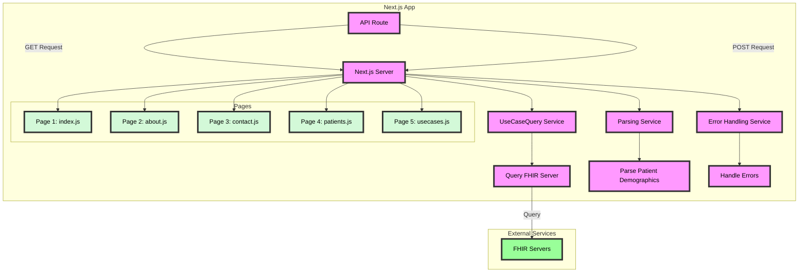

## Getting Started with Query Connector

### Introduction

The DIBBs Query Connector app offers a REST API for searching for a patient and viewing information tied to your case investigation.

### Running Query Connector (Prerequisites)

The Query Connector app can be run using Docker (or any other OCI container runtime e.g., Podman), or directly from the Node.js source code. Confirm that you have Docker installed by running `docker -v`. If you do not see a response similar to what is shown below, follow [these instructions](https://docs.docker.com/get-docker/) to install Docker.

```
❯ docker -v
Docker version 20.10.21, build baeda1f
```

#### Running with Docker (Recommended)

1. Download a copy of the Docker image from the Query Connector repository by running `docker pull ghcr.io/cdcgov/dibbs-query-connector/query-connector:latest`.
   1. If you're using an M1 Mac, you'll need to tell Docker to pull the non-Apple Silicon image using `docker pull --platform linux/amd64 ghcr.io/cdcgov/dibbs-query-connector/query-connector:latest` since we don't have a image for Apple Silicon. If you're using this setup, there might be some issues with architecture incompatability that the team hasn't run into, so please flag if you run into something!
2. Run the service with `docker run -p 3000:3000 query-connector:latest`. If you're on a Windows machine, you may need to run `docker run -p 3000:3000 ghcr.io/cdcgov/phdi/query-connector:latest` instead.

The containers should take a few minutes to spin up, but if all goes well, congratulations, the Query Connector app should now be running on `localhost:3000/query-connector`!

#### Running from Dev Mode via the Node.js Source Code

We recommend running the Query Connector app from a container, but if that is not feasible for a given use-case, it may also be run directly from Node using the steps below.

1. Ensure that both [Git](https://git-scm.com/book/en/v2/Getting-Started-Installing-Git) and [Node 18.x or higher](https://nodejs.org/en/download/package-manager/current) are installed.
2. Clone the Query Connector repository with `git clone git@github.com:CDCgov/dibbs-query-connector.git`.
3. Navigate to the source folder with `cd /query-connector/`.
4. Install all of the Node dependencies for the Query Connector app with `npm install`.
5. Run the Query Connector app on `localhost:3000` with `npm run dev`. If you are on a Windows Machine, you may need to run `npm run dev-win` instead.

The containers should take a few minutes to spin up, but if all goes well, congratulations, the Query Connector app should now be running on `localhost:3000`!

### Building the Docker Image

To build the Docker image for the Query Connector app from source instead of downloading it from the PHDI repository follow these steps.

1. Ensure that both [Git](https://git-scm.com/book/en/v2/Getting-Started-Installing-Git) and [Docker](https://docs.docker.com/get-docker/) are installed.
2. Clone the Query Connector repository with `git clone git@github.com:CDCgov/dibbs-query-connector.git`.
3. Navigate to `/query-connector`.
4. Run `docker build -t query-connector .`.

### Running via docker-compose (WIP)

The Query Connector will eventually require other inputs from other DIBBs services. For now, this is a simplified docker compose file that starts the Node service. This can be run with `docker compose up --build`. See the [Docker Compose documentation](https://docs.docker.com/engine/reference/commandline/compose_up/) for additional information.

### Query Connector Data for Query Building

When initializing the backend database for the first time, the Query Connector makes the value sets associated with 200+ reportable conditions available to users tasked with building queries for their jurisdiction. To run this seeding script, you'll need to obtain the UMLS and eRSD API key's using the instructions below.

To group value sets by condition and to group the conditions by type, the Query Connector obtains and organizes data from the eRSD and the VSAC in the following way:

1. The Query Connector retrieves the 200+ reportable conditions from the eRSD as well as the value sets' associated IDs.
2. Using the value set IDs from the eRSD, the Query Connector retrieves the value set's comprehensive information from the VSAC, i.e., the LOINC, SNOMED, etc. codes associated with each value set ID.
3. The Query Connector then organizes these value sets according to the conditions with which they're associated, making the result available to users interested in building queries. The conditions are additionally organized by category, e.g., sexually transmitted diseases or respiratory conditions, using a mapping curated by HLN Consulting.

#### Query Building Data in `dev` mode

In order to make the dev process as low-lift as possible, we want to avoid executing the `db-creation` scripts when booting up the application in dev mode via `npm run dev` or `npm run dev-win`. To that end, we've created a `pg_dump` file containing all the value sets, concepts, and foreign key mappings that would be extracted from a fresh pull of the eRSD and processed through our creation functions. This file, `vs_dump.sql` has been mounted into the docker volume of our postgres DB when running in dev mode as an entrypoint script. This means it will be automatically executed when the DB is freshly spun up. You shouldn't need to do anything to facilitate this mounting or file running.

#### Obtaining an eRSD API Key

Before running the Query Connector locally, you will need to obtain an API key for the electronic Reporting and Surveillance Distribution (eRSD), Unified Medical Language System (UMLS), and Aidbox. With the API key, you have access to 200+ pre-built queries for reportable conditions, e.g., chlamydia, influenza, hepatitis A, etc. These queries can be used and modified in the Query Connector app.
``

To obtain the free API keys, please visit the following URLs and follow the sign up instructions.

- [https://ersd.aimsplatform.org/#/api-keys](https://ersd.aimsplatform.org/#/api-keys)
- [https://uts.nlm.nih.gov/uts/login](https://uts.nlm.nih.gov/uts/login)
- [https://aidbox.app/](https://aidbox.app/)

Next, set up your `.env` file with the following command: `cp .env.sample .env`

Adjust your `DATABASE_URL` as needed.

Add your API keys as an environment variables called `ERSD_API_KEY`, `UMLS_API_KEY`, and `AIDBOX_LICENSE` in the `.env` file so that they can be accessed when running the Query Connector app.

#### Running Keycloak for Authentication

```
docker compose -f docker-compose-dev.yaml up keycloak
```

To login via Keycloak, make sure your `.env` is updated using `cp` command above and use the following credentials to login at `localhost:8080` after spinning up the container:

```
Username: qc-admin
Password: QcDev2024!
```

Next, run the app with `npm run dev` or `npm run dev-win`. You should see a sign in button at [http://localhost:3000](http://localhost:3000). Click it and login with the above credentials, and it should redirect back to [http://localhost:3000/query](http://localhost:3000/query)!

### Developer Documentation

A Postman collection demonstrating use of the API can be found [here](https://github.com/CDCgov/dibbs-query-connector/blob/main/query-connector/src/app/assets/DIBBs_Query_Connector_API.postman_collection.json).

#### Updating the pg_dump

If the DB extract file ever needs to be updated, you can use the following simple process:

1. Start up the application on your local machine using a regular `docker compose up`, and wait for the DB to be ready.
2. Load the eRSD and value sets into the DIBBs DB by using the `Create Query` button on the `/queryBuilding` page. Optionally, use DBeaver to verify that value sets exist in the database.
3. In a fresh terminal window, run

```
pg_dump -U postgres -f vs_dump.sql -h localhost -p 5432 tefca_db
```

If the above doesn't work, try replacing `localhost` with `0.0.0.0`.

4. Enter the DB password when prompted.
5. The extract file, `vs_dump.sql`, should now be created. It should automatically be located in `/query-connector`, but if it isn't, put `vs_dump.sql` there.

#### Running the e2e tests locally

The Query Connector uses Playwright Test as its end-to-end testing framework. Playwright is a browser-based testing library that enables tests to run against a variety of different browsers under a variety of different conditions. To manage this suite, Playwright creates some helpful files (and commands) that can be used to tweak its configuration.

##### Config and Directories

Playwright's configuration is managed by the file `playwright.config.ts`. This file has information on which browsers to test against, configuration options for those browsers, optional mobile browser ports, retry and other utility options, and a dev webserver. Changing this file will make global changes to Playwright's operations.

By default, Playwright will look for end to end tests in `/e2e`.

##### Testing Commands and Demos

Playwright provides a number of different ways of executing end to end tests. From the `query-connector/` directory, you can run several commands:

`npm run test:playwright:ui`
Runs the end-to-end tests locally by spawning the Playwright UI mode. This will start a dev server off localhost:3000, so make sure you don't have another app instance running off that port.

You'll need to have a token for Aidbox set under AIDBOX_LICENSE in your .env for the Aidbox seeder to run correctly. You can sign up for a dev license at https://aidbox.app and use that in your local setup.

`npm run test:playwright`
Runs the end-to-end tests.

`npm run test:playwright -- --project=chromium`
Runs the tests only on Desktop Chrome.

`npm run test:playwright -- example`
Runs the tests in a specific file.

`npm run test:playwright -- -g "test name"`
Runs the test with the name "test name", e.g., Query("test name") would run here.

`npm run test:playwright -- --debug`
Runs the tests in debug mode.

`npm run test:playwright -- codegen`
Auto generate tests with Codegen.

After running a test set on your local, you can also additionally type `npx playwright show-report` to view an HTML report page of different test statuses and results.

Playwright is managed by an end-to-end job in the `.github/workflows/ci.yaml` file of the project root. Since it requires browser installation to effectively test, and since it operates using an independent framework from jest, it is explicitly _not_ included in the basic `npm test` scripts (specified in `package.json`).

### Query Connector ERD


### Architecture Diagram



### Infrastructure Architecture Diagram

**ECS Infrastructure**


**VM Infrastructure**

