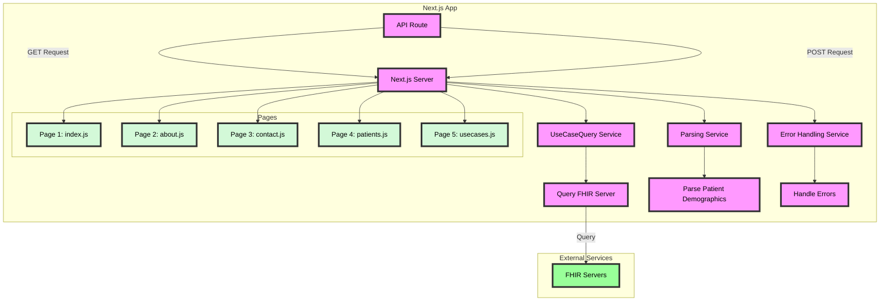

[← Back to Documentation](/docs)

### Query Connector ERD

### Architecture Diagram

```mermaid
graph TD
  subgraph Next.js App
    direction TB

    A[API Route] -->|GET Request| B[Next.js Server]
    A[API Route] -->|POST Request| B[Next.js Server]

    B --> C[UseCaseQuery Service]
    B --> D[Parsing Service]
    B --> E[Error Handling Service]

    C --> F[Query FHIR Server]
    D --> G[Parse Patient Demographics]
    E --> H[Handle Errors]

    subgraph Pages
      direction TB
      P1[Page 1: index.js]
      P2[Page 2: about.js]
      P3[Page 3: contact.js]
      P4[Page 4: patients.js]
      P5[Page 5: usecases.js]
    end

    B --> P1
    B --> P2
    B --> P3
    B --> P4
    B --> P5
  end

  subgraph External Services
    direction TB
    I[FHIR Servers]
  end

  F -->|Query| I

  %% Legends
  classDef next fill:#f9f,stroke:#333,stroke-width:4px,color:#000;
  classDef pages fill:#d3f9d8,stroke:#333,stroke-width:4px,color:#000;
  classDef external fill:#9f9,stroke:#333,stroke-width:4px,color:#000;

  class A,B,C,D,E,F,G,H next;
  class P1,P2,P3,P4,P5 pages;
  class I external;
```

### Infrastructure Architecture Diagram

**ECS Infrastructure**

**VM Infrastructure**

