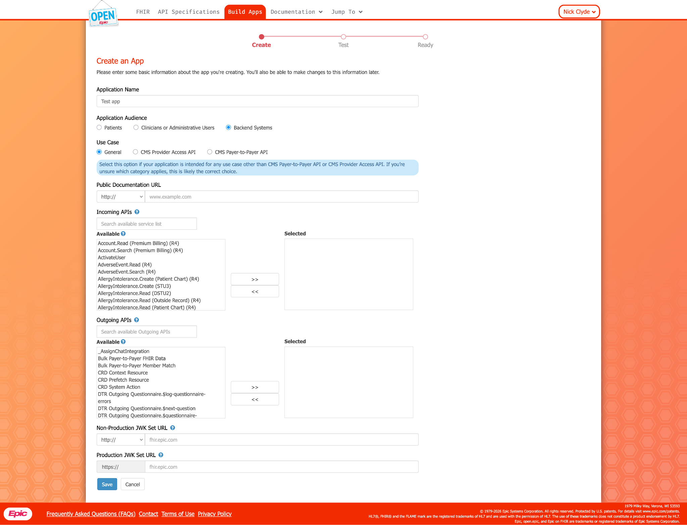
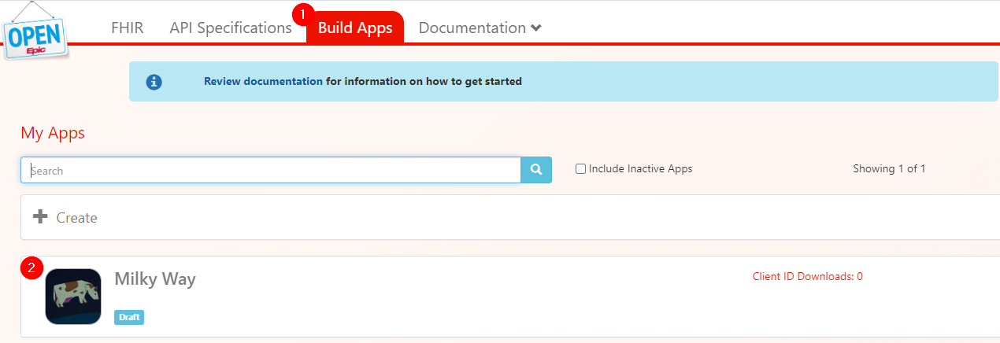
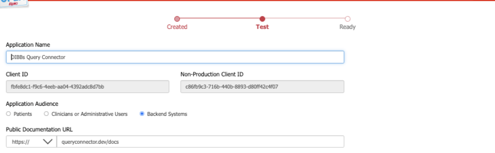
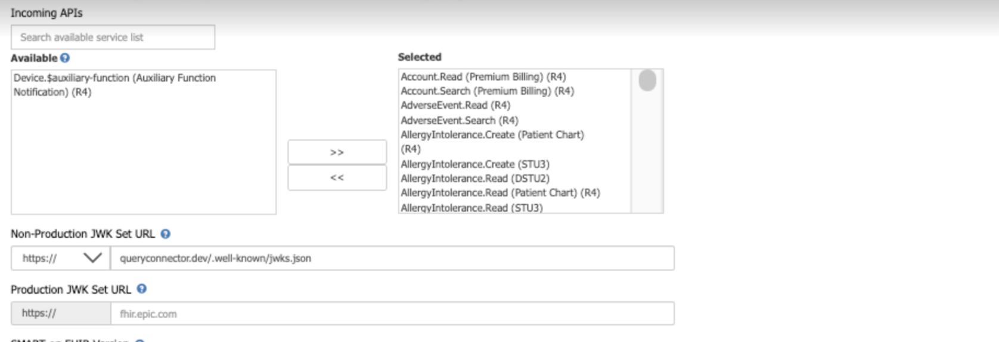
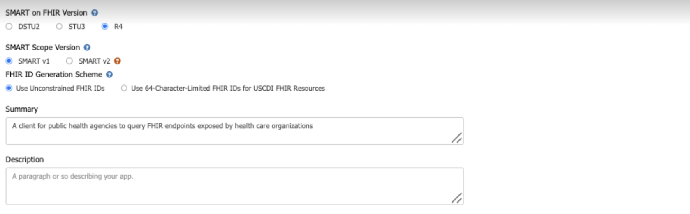
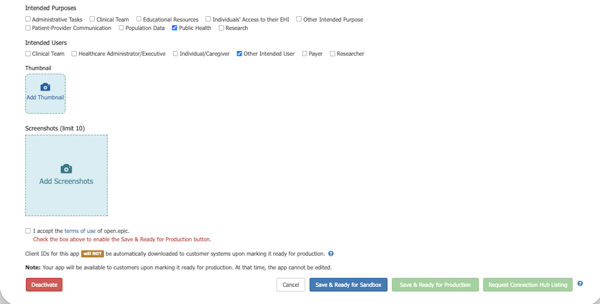
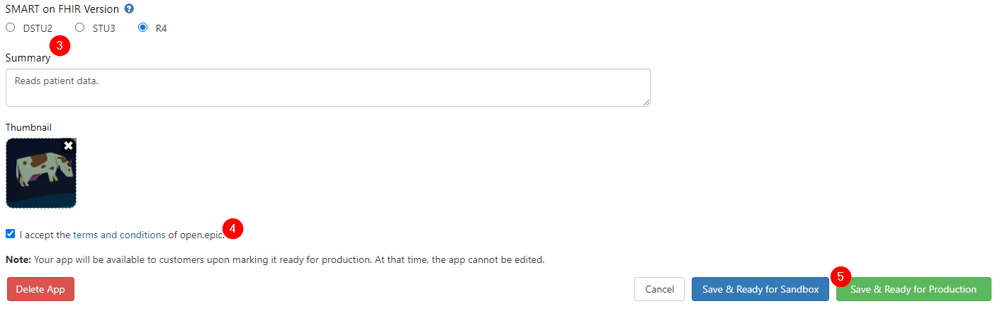
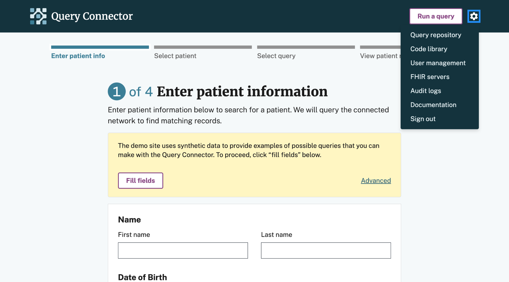
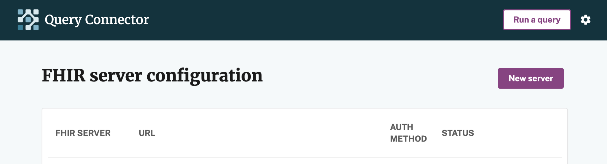
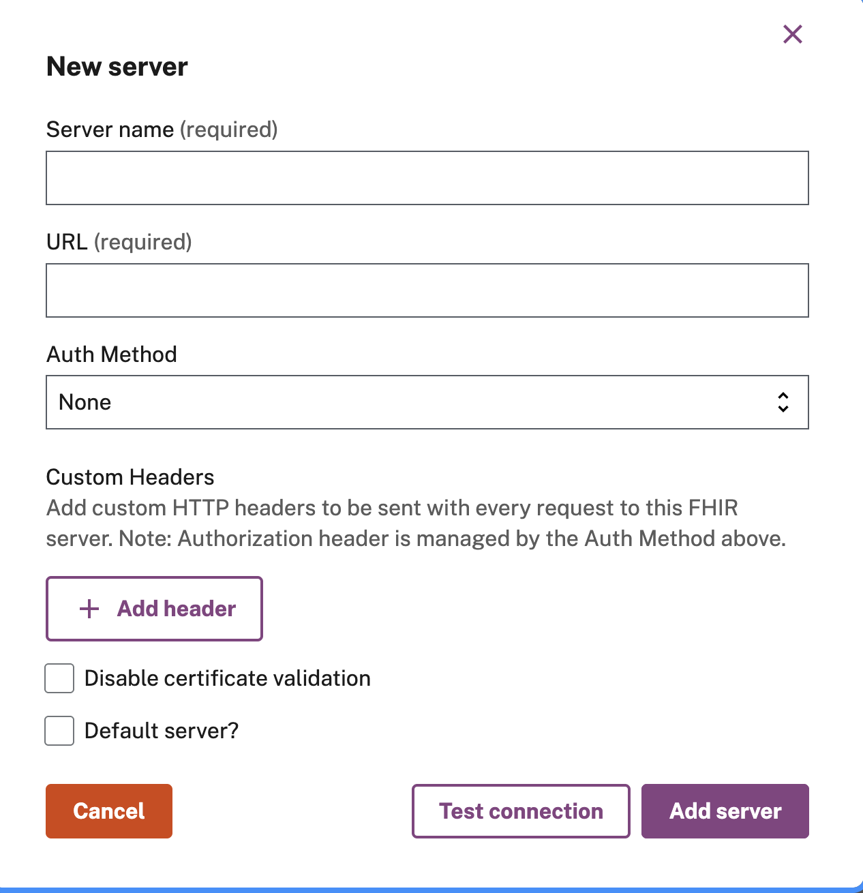

[← Back to Documentation](./table-of-contents.mdx)

# Query Connector FHIR Connection Guide — Epic [draft]

This guide provides instructions for setting up a FHIR connection between Query Connector (QC) and a healthcare organization (HCO) that uses Epic.

## Contents

- [Process overview](#process-overview)
- [1. Register QC with Epic](#1-register-qc-with-epic)
  - [Create a new app registration](#create-a-new-app-registration)
  - [Complete configuration](#complete-configuration)
  - [Test for proper functionality](#test-for-proper-functionality)
  - [Mark ready for production](#mark-ready-for-production)
- [2. Grant QC access to FHIR APIs](#2-grant-qc-access-to-fhir-apis)
  - [Provide Client IDs to the HCO](#provide-client-ids-to-the-hco)
  - [HCO internal security configuration](#hco-internal-security-configuration)
  - [Collect HCO connection details](#collect-hco-connection-details)
- [3. Add HCO FHIR endpoint to QC](#3-add-hco-fhir-endpoint-to-qc)
  - [Create a new FHIR entry](#create-a-new-fhir-entry)
  - [Enter the HCO's connection details](#enter-the-hcos-connection-details)
  - [Test and save](#test-and-save)

## Process overview

At a high level, the FHIR connection process works as follows:

1. A jurisdiction registers its QC instance with an EHR vendor (for example, Epic), which creates a reusable FHIR client representing that QC instance.
2. An individual HCO using that EHR system then grants the registered QC client access to their FHIR APIs.
3. Once access has been granted, the jurisdiction configures QC with the HCO-specific FHIR endpoint details.

The following instructions walk through this process, using Epic as a concrete example.

## 1. Register QC with Epic

To establish a direct connection between QC and Epic-based HCOs, the jurisdiction must first register its QC instance as an Epic on FHIR application.

### Create a new app registration

Registering your QC instance through the steps below will create an application record and assign production and non-production client IDs.

1. Go to Epic's developer resources ([Epic on FHIR](https://fhir.epic.com/Developer/Index)) and sign in or create an account.
2. Navigate to the Build Apps page.
3. Select "Create My First App" or if you already have apps created, select "Create."
4. Complete the "Create an App" form by filling out:
   1. The app name: Use the jurisdiction-specific QC instance name so it's clearly reusable across Epic-based HCOs
   2. The app audience: Backend Systems
   3. Incoming APIs: Select all
   4. JWK Set URLs: Your instance's URL followed by "/.well-known/jwks.json" (e.g., [https://queryconnector.dev/.well-known/jwks.json](https://queryconnector.dev/.well-known/jwks.json))

5. Then click Save to register your instance of QC in Epic.

### Complete configuration

1. After saving, navigate to "Build Apps" and open the newly created QC instance to complete the configuration details.

2. Review and complete any additional fields required for your integration, such as:
   - Production and Non-Production Client IDs
   - Public Documentation URL
   - Incoming APIs
   - JWK/JWKS settings
   - SMART on FHIR version
   - SMART Scope version
   - FHIR ID Generation Scheme
   - Summary
   - Description
   - Intended Purpose
   - Intended Users

3. Click "Save & Ready for Sandbox" after updating fields.

### Test for proper functionality

1. Allow time for Epic to sync changes to the sandbox (Epic notes this may take up to ~1 hour after creating or updating a draft application).
2. Test against the Epic sandbox to confirm QC can authenticate and make the intended API calls using sandbox test data.

### Mark ready for production

After testing is complete:

1. Return to Build Apps and open the app.
2. Finalize the application details.
3. Click Save & Ready for Production.

## 2. Grant QC access to FHIR APIs

After your QC instance is marked Ready for Production in Epic on FHIR, each Epic-based HCO must complete internal steps to allow that QC client to access their FHIR APIs. The HCO owns the security and account configuration, but you'll support the process by sharing the right client ID and collecting the HCO's connection details.

### Provide Client IDs to the HCO

1. Share the appropriate Client ID from the Epic on FHIR app details page:
   1. Non-Production Client ID (for sandbox/testing)
   2. Production Client ID (for production)
2. The HCO's IT team will use the [App Request process](https://fhir.epic.com/Documentation?docId=epiconfhirrequestprocess&section=custreq) to download your QC instance's Client ID and [map it to an Epic user account](https://fhir.epic.com/Documentation?docId=oauth2&section=Backend-Oauth2_Customer-Setup) for auditing and security.

**Note:** Make sure the HCO uses the Client ID that matches the environment they are enabling (non-prod vs prod).

### HCO internal security configuration

The HCO configures their Epic environment so the QC client can access the APIs you selected under Incoming APIs. They will be able to identify the required configuration based on your Client ID. This typically includes:

- User and security setup (e.g., associating the app with an Epic user/service account)
- Any required application and access control configuration within Epic

For reference, QC queries the following FHIR R4 resources, so at minimum the search/read APIs for these resources must be enabled for the QC client:

- Patient (including `$match` for patient discovery)
- Observation
- DiagnosticReport
- Condition
- Encounter
- MedicationRequest (and related Medication and MedicationAdministration resources)
- MedicationStatement
- Immunization
- ServiceRequest (and related Practitioner and Specimen resources)

### Collect HCO connection details

To complete QC setup for a specific HCO, ask the HCO's IT team to provide the details below to point QC at the right FHIR endpoint and align on any HCO-specific values:

1. FHIR endpoint connectivity
   1. Epic Interconnect FHIR base URL for the environment (non-prod and/or prod)
   2. Any network requirements

**Note:** Before moving to Section 3, confirm the HCO has completed their activation/security steps and provided the FHIR endpoint details for the correct environment.

## 3. Add HCO FHIR endpoint to QC

In this section, you'll add the HCO's FHIR endpoint to Query Connector so QC knows where to send FHIR API requests. You'll enter the FHIR server URL and authentication settings, then test and save the connection.

### Create a new FHIR entry

1. Open Query Connector.
2. Select the settings (gear) icon in the upper-right.
3. From the setting menu, click "FHIR servers."

4. On the "FHIR server configuration" page, click "New server."

### Enter the HCO's connection details

On the "New server" page, complete the following fields:

1. Server name: a clear label (e.g., Stanford (Non-Prod) or Cedars (Prod)).
2. URL: the HCO's Epic FHIR base URL for the correct environment
3. Auth Method: SMART on FHIR
4. Custom Headers:
   - Accept: application/fhir+json
   - Content-Type: application/fhir+json; charset=UTF-8

Optional settings:

- Disable certificate validation: Unchecked
- Default server: check if this will be the primary FHIR server used for queries.

### Test and save

1. Click "Test connection" to verify QC can reach the HCO FHIR endpoint. If the test succeeds, click "Add server."
2. The HCO's FHIR endpoint is now configured in Query Connector. The server will appear in your FHIR servers list and can be used for queries.
