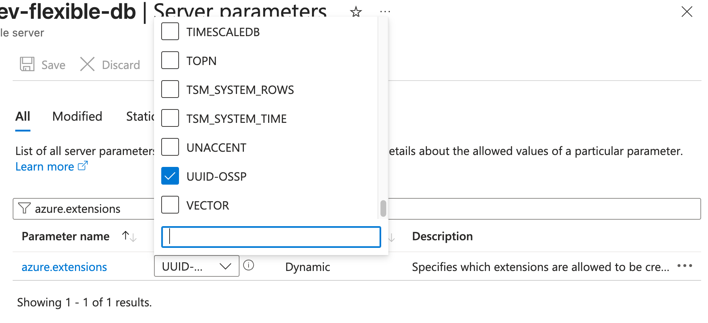

# Azure Console Setup Instructions for Terraform Deployment

To prepare your Azure subscription for Terraform deployments, follow the steps below to create and configure the necessary resources.

---

## ✅ Prerequisites

Ensure that the following are in place:

- Access to the Azure portal: https://portal.azure.com
- Appropriate permissions to create and manage Azure resources
- Azure CLI (optional, but useful for automation): [Install Azure CLI](https://learn.microsoft.com/en-us/cli/azure/install-azure-cli)

---

## 1. Create a Resource Group, Storage Account, Blob Container and Key Vault

These will be used to store Terraform state files.

### Step 1: Create a Resource Group

1. Navigate to **Resource groups**.
2. Click **+ Create**.
3. Provide:
   - **Subscription**: Your target subscription
   - **Resource Group Name**: e.g., `terraform-rg`
   - **Region**: e.g., `West US 2`
4. Click **Review + Create**, then **Create**.

### Step 2: Create a Storage Account

1. Go to **Storage accounts**.
2. Click **+ Create**.
3. Provide:
   - **Subscription**: Same as above
   - **Resource Group**: Select the one created earlier
   - **Storage account name**: e.g., `qcdevstorageaccount` (must be globally unique)
   - **Region**: Same as the resource group
   - **Performance**: Standard
   - **Redundancy**: Locally-redundant storage (LRS)
4. Click **Review + Add Create**, then **Create**.

### Step 3: Create a Blob Container

1. Open the created storage account.
2. Navigate to **Containers** under **Data storage**.
3. Click **+ Container**.
4. Enter a name (e.g., `tfstate`) and set **Public access level** to **Private**.
5. Click **Create**.


### Step 4: Create a Key Vault

1. Go to **Key Vaults**.
2.  Click **+ Create**.
3. Provide:
   - **Subscription**: Same as above
   - **Resource Group**: Select the one created earlier
   - **Key Vault name**: e.g., `keyvault123456qc` (must be globally unique)
   - **Region**: Same as the resource group
   - **Pricing Tier**: Standard
4. Click **Review + Create**, then **Create**.
5. Open the create key vault.
6. Navigate to **Access control (IAM)**
7. Click **+Add Add role assignment**
8. Search for **Key Vault Administrator** and click it
9. Click **Next**
10. Click **+Select members**
11. Search for you user name and click it, Click **Select**
12.  Click **Review + assign**, then **Review + assign**.

---

## 2. Engineer Access

This allows Terraform to authenticate against Azure.

###  Use an Existing Engineer Account

If running Terraform locally, ensure your Azure account has at least **Contributor** access to the target resource group. And Permissions to create and read secrets in the Key Vault created earlier.

---

## 3. Register Required Azure Resource Providers

Ensure that all necessary resource providers are registered, especially if deploying services like App Gateway or Container Apps.

### Steps:

1. Go to **Subscriptions** in the Azure portal.
2. Select your subscription.
3. Click **Resource providers** under **Settings** in the left menu.
4. Search for and register the following (examples):
   - `Microsoft.App`
   - `Microsoft.ContainerInstance`
   - `Microsoft.Network`
   - `Microsoft.OperationalInsights`
**If you are not sure which Resource Providers are needed, leave as is**
5. Click **Register** for each as needed.

---

## ✅ Summary

You should now have:
- A resource group and storage account for Terraform state
- An Engineer that has access with Contributor rights
- All required resource providers registered

You’re ready to deploy with Terraform!


## Cloud Prerequisites
The target Azure subscription must have the following:
* An existing Resource Group and Storage Account to store Terraform state files
* A Service Principal with Contributor access to the Resource Group (or an engineer with equivalent or greater access, if running from a personal machine)
* Active Azure resource providers for the services being deployed (e.g., Azure App Gateway, Azure Container Apps, etc.)

# Deployment
User-modifiable code exists in the `app_service` folder.
Be sure to review `_config.tf` and `main.tf` for variables and inputs that can be customized to fit your installation.
    - `TODO` means the value needs to be change or verified 


Before you deploy, ensure that you have the prerequisites installed and configured. Then, run the following commands in the `app_service` folder:
    
```bash
terraform init
terraform plan
```
Ensure there are no configuration errors, and review the plan output to confirm that the resources to be created are as expected. If everything looks good, run:

```bash
terraform apply
```

## ✅ Summary

You should now have deployed Query Connector!

1. Go to **App Services**.
2. Select the App service that was deployed. 
3. Navigate to **Properites**, and click the **Default Domain**


## View Logs

To View logs for App Service:
1. Go to **App Services**.
2. Select the App service that was deployed.
3. Click **Deployment Center** under Deployment on the left panel
4. Click **Logs**

## Common Errors

1. ```ERROR: extension "uuid-ossp" is not allow-listed for users in Azure Database for PostgreSQL```

   **Fix**:
      1. Go to ***Azure Database for PostgreSQL flexible server***.
      2. Select the PostgreSQL flexible server for Query Connector
      3. Navigate to ***Server Parameters***
      4. Enter `azure.extensions` in the Search Bar, select the CheckBox beside `UUID-OSSP` (see screenshot below for reference)
      5. Click **Save**

     
